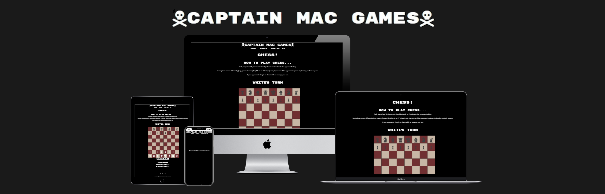
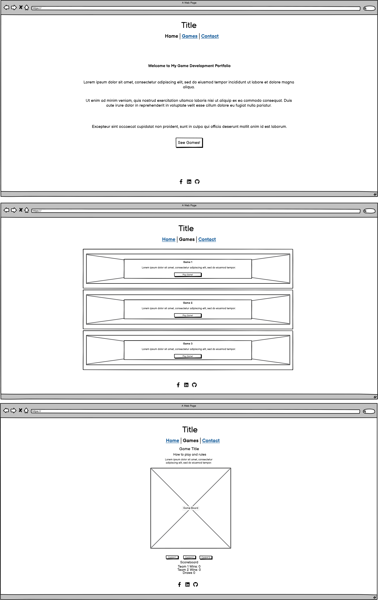
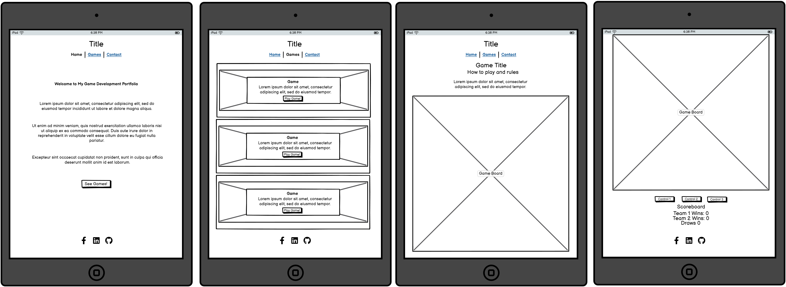
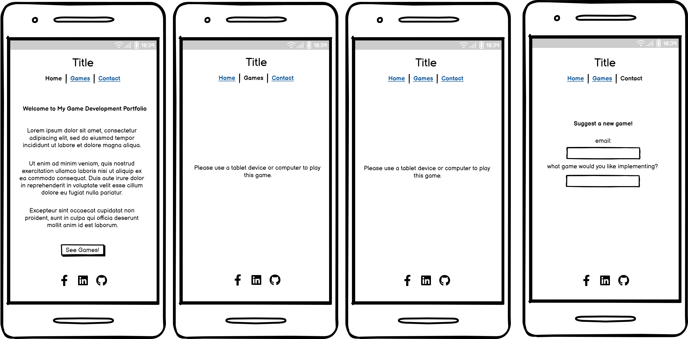

# Milestone Project 2 - [Captain Mac Games]

---

## Table of Contents
1. [Overview](#overview)
2. [User Experience (UX)](#user-experience-ux)
   - [User Stories](#user-stories)
   - [Design](#design)
   - [Wireframes](#wireframes)
3. [Features](#features)
4. [Technologies Used](#technologies-used)
5. [Testing](#testing)
6. [Deployment](#deployment)
7. [Credits](#credits)
8. [Acknowledgements](#acknowledgements)

## Overview

[Captain Bernie Mac Games] is a is an interactive and engaging game tool designed to provide entertainment and educate users on a specific game. The site features a user-friendly interface, vibrant design elements, and responsive layouts that ensure a seamless experience across all devices. By playing the games, track their progress and view their scores as they go, making it both enjoyable and informative.

## User Experience (UX)

### User Stories
- **First Time Visitor Goals**
  - As a first-time visitor, I want to Learn how to play the games.
  - As a first-time visitor, I want to be able to compete against a friend when playing the games.
  
- **Returning Visitor Goals**
  - As a returning visitor, I want to have more games to play, meaning constant development for new games to be added.

### Design
- **Color Scheme:** 
The color scheme for this project is Black, im a big fan of pirates and it was fitting for the name of the website to reflect that, making black the only suitable colour in my opinion to give the black flag feeling in the background.

- **Typography:** 
The main font used is a very weighted Ysabeau, it gives a great asthetic to give the old arcade gaming vibe to the vebsite, with big block letters similar to how they would have been on the screen of an arcade machine and so on.

- **Imagery:** 
Imagery is used to just decorate the games themselves, such as an image for the board, or the board peices, some videos have been used for the game page as background for the cards rather than still images.

### Wireframes
- 
- 
- 

## Features

### Existing Features

- **Noughts and Crosses Game:**  
  This classic game, also known as Tic-Tac-Toe, allows users to play against either the computer or another player. The game features a clean, intuitive interface where users place their Xs and Os on a 3x3 grid. The game tracks wins, losses, and draws, providing immediate feedback on the game outcome and ensuring an engaging experience for players of all ages.
  [Image]

- **Snakes and Ladders Game:**  
  The Snakes and Ladders game brings this timeless board game to the digital realm. Players roll dice to advance their tokens across a virtual board. The game includes colorful graphics and animations that make moving up ladders and sliding down snakes visually appealing. The game keeps track of player progress and provides a simple, enjoyable way to experience this classic game online.
  [Image]

- **Chess Game:**  
  The chess game offers a fully functional chessboard where users can play against the computer or another player. It includes features such as move highlighting, piece capturing, and a basic AI opponent for solo play. The game follows traditional chess rules and provides a strategic challenge for players of varying skill levels.
  [Image]

- **Scoreboards:**  
  The site includes dynamic scoreboards that display player rankings and game scores. These scoreboards provide users with a competitive edge by showcasing the highest scores and recent achievements across the different games. The scoreboards are updated in real-time and are designed to encourage users to improve their performance and climb the leaderboard.
  [Image]

### Features Left to Implement

- **Scoreboard and Winning Message for the Chess Game:**  
  Plans are in place to add a dedicated scoreboard for the chess game, which will track player rankings and game results. Additionally, a winning message feature will be implemented to provide feedback and celebrate victories when a game is won. This enhancement will add a layer of competitiveness and recognition to the chess experience.

- **More Games, Progress Tracking, and Various Game Levels:**  
  Future updates will include the addition of more games to broaden the selection and provide more entertainment options. Progress tracking features will be introduced, allowing users to monitor their performance and achievements across different games. Various game levels and difficulty settings will also be added to cater to players of different skill levels and ensure ongoing engagement and challenge.

## Accessability

  While building the website I have been mindful of accessability by doing the following:

- Using semantic HTML elements.
- Adding hover effects to all interactive links and also making them keyboard-focusable.
- Using a primary font that was designed with readability in mind.
- Choosing colours that have a good contrast across the site.
- Alt tags added to all images, even the ones used within the game. 

## Technologies Used
- [html](path) - Used to structure the website.
- [css](path) - Used to style the website.
- [javascript](path) - Used to make the website interactive.
- [VSCode](https://code.visualstudio.com/) - IDE of choice for the site.
- [Git](https://git-scm.com/) - For version control.
- [GitHub](https://github.com/) - To store all files relating to the project.
- [Balsamiq](https://balsamiq.com/) - For the wireframes used to mock-up the site.
- [Favicon.io](https://favicon.io/) - Used for the sites favicon.
- [Canva](https://www.canva.com/en_gb/) - Used to create various images across the site such as boards and peices.
- [Google Fonts](https://fonts.google.com/) - For the font used across the site.
- [Font Awesome](https://fontawesome.com/) - For the brand icons.
- [Google Dev Tools](https://developer.chrome.com/docs/) - Dev tools used throughout the build process.
- [Boostrap 5.3](https://getbootstrap.com/) - Used various assets/custom classes across the site to aid with development speed and responsiveness.

## Testing

Please see [TESTING.md](TESTING.md) for all testing that has been carried out.

## Deployment

### GitHub Pages
The project was deployed using GitHub Pages. The steps to deploy are as follows:
1. Log in to GitHub and navigate to the repository.
2. In the repository, navigate to the **Settings** tab.
3. Scroll down to the **GitHub Pages** section.
4. Under **Source**, select the branch to deploy from and click **Save**.
5. The website will be live at: [https://berniemachub.github.io/Milestone-Project-2/](https://berniemachub.github.io/Milestone-Project-2/)

### Local Deployment
To deploy the project locally:
1. Clone the repository using the following command:  git clone https://github.com/BernieMacHub/Milestone-Project-2.git
2. Open the `index.html` file in a browser to view the project.

## Credits

- **Canva** - Used to create all the images, videos and other media used across the site.

- **YouTube** - Various tutorials and walkthroughs helped in understanding game development concepts and JavaScript code snippets. Some valuable channels include:
  - [Traversy Media](https://www.youtube.com/user/TechGuyWeb) - Offers comprehensive tutorials on JavaScript and game development.
  - [The Net Ninja](https://www.youtube.com/channel/UCW5YeuERMmlnqo4oq8vwUpg) - Provides in-depth series on JavaScript and front-end development.
  - [freeCodeCamp.org](https://www.youtube.com/freecodecamp) - Features extensive tutorials on JavaScript and interactive projects.

- **Kevin Powell** - His content on CSS and web design helped in styling and making the games visually appealing. Visit his channel [here](https://www.youtube.com/channel/UCMwGHR0vduoM2Zb7f9r7Tg).

- **Tutorialspoint** - Utilized for various JavaScript tutorials and validation of code. Explore their resources [here](https://www.tutorialspoint.com/javascript/index.htm).

- **Stack Overflow** - A valuable resource for troubleshooting and solving specific JavaScript issues. Check out the [JavaScript questions](https://stackoverflow.com/questions/tagged/javascript) on Stack Overflow.

- **MDN Web Docs** - Provided detailed documentation and examples for JavaScript features used in the project. Visit [MDN JavaScript](https://developer.mozilla.org/en-US/docs/Web/JavaScript) for comprehensive documentation.

- **W3Schools** - Offered examples and explanations of JavaScript code and HTML/CSS basics. Explore their JavaScript section [here](https://www.w3schools.com/js/).

- **CodePen** - For interactive code examples and community-driven snippets. Explore [CodePen](https://codepen.io/) for game-related examples and inspiration.

## Acknowledgements
- I would like to thank UCP-15 Discord - For always providing feedback on my project.
- Juliia Konovalova - My Code Institute mentor.
- Fellow students - working together in a discord to share ideas and give feedback on each other's work.